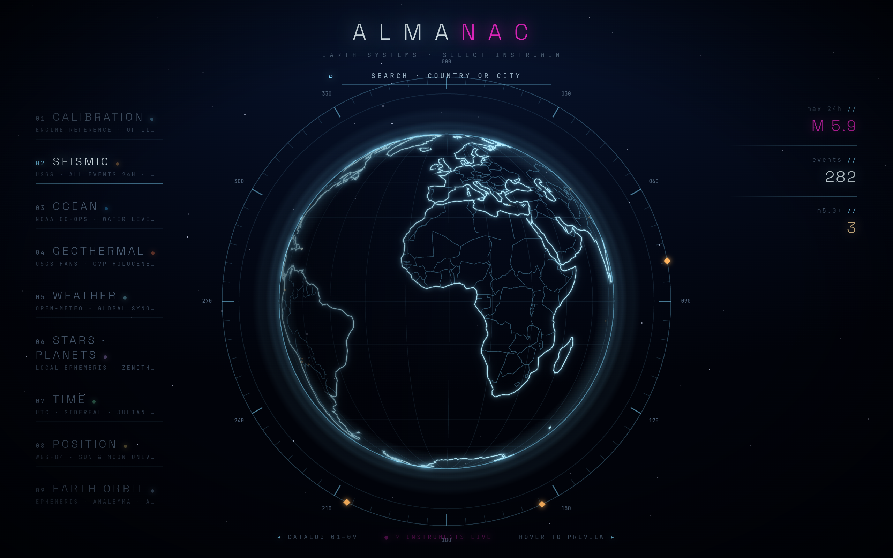

<div align="center">

# almanac

### A precision instrument for reading Earth's live systems — rendered as a cinematic globe.

*No accounts, no trackers, no ads — private by design.*

**▶ Live — [codereimagine.github.io/almanac](https://codereimagine.github.io/almanac/)**

<p>
  
</p>

<sub>Nine instruments — <b>seismic · ocean · geothermal · weather · sky · time · position · orbit</b> — each with a live path and an honest offline fallback.</sub>

**By Bert Peters** · [codereimagine](https://github.com/codereimagine)

</div>

---

almanac reads Earth's live systems — **seismic · ocean · geothermal · weather · sky · time · position · orbit** — and renders them as a cinematic globe with per-place readouts. Pick an instrument, or search any point on Earth, and the dossier answers.

## What it is

- **A globe of instruments.** Nine Earth-systems instruments, selectable from one cinematic index. Hover to preview, click to open, search any country or city to drop a dossier on that point.
- **Live, with an honest fallback.** Every instrument has a live data path *and* a labelled offline path — it never pretends. The sky/time/position/orbit instruments are always-live (computed on-device, LIVE even fully offline).
- **Private by design — no accounts, no trackers, no ads.** The only network calls are the keyless public data feeds below, fetched only for the instrument you open. Nothing about you is collected or sent.
- **Installable PWA.** Works offline once cached.

## Data sources

All keyless, no accounts:

- **Weather** — Open-Meteo + MET.no
- **Earthquakes / volcanic alerts** — USGS
- **Tides / water level** — NOAA CO-OPS
- **Sky / position / orbit** — on-device astronomy (no network)

## Architecture

`@almanac/engine` is the instrument design system — tokens, schema, chrome, and the canvas + feed seams. Each page under `site/src/pages` is a plugin: a new instrument is a folder, no engine edits. A monorepo (`site` · `packages` · `gates`) with a real-browser gate battery that every instrument must pass — live path *and* offline path — before any ship.

## Tech

Vite · React · TypeScript · three.js / react-three-fiber (the globe) · `astronomy-engine`. An installable PWA.

## Run it locally

```sh
npm install
npm run dev        # http://localhost:5180
npm run build      # type-check + production build → site/dist
npm run preview    # serve the build
```

## Credits

Built with [Claude Code](https://claude.com/claude-code).

## License

[Apache-2.0](LICENSE).
